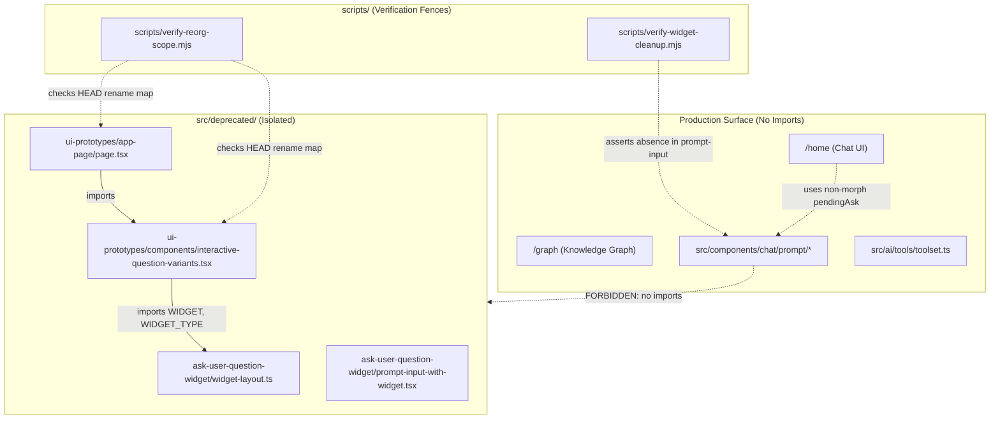

# Audit Report: Deprecated Code & Verification Scripts Domain

**Audit Date:** 2026-08-08  
**Domain Scraped:** `src/deprecated` + `scripts/verify-*`  
**Target Repository:** `spy-frontend`  
**Status:** Audit Complete — Recommendation Only (No Files Deleted)

---

## Executive Summary

- **Production Import Status:** `src/deprecated/` has **ZERO** production imports in application routes (`/`, `/home`, `/graph`), API routes (`/api/*`), components, schemas, tools, hooks, or context providers.
- **Production Runtime Impact if Deleted:** **0% (Zero Risk)** — Deleting `src/deprecated/` will not break any production user experience, build step (`npm run build`), or API endpoint.
- **Script & Test Coupling:** `scripts/verify-reorg-scope.mjs` contains `RENAME_MAP` references to `src/deprecated/ui-prototypes/`. `scripts/verify-widget-cleanup.mjs` verifies production UI is clean of morph code but does not depend on `src/deprecated` existing.
- **Delete Confidence Score:** **95% (High)** — Technically 100% safe for production bundle/runtime; 95% overall due to minor updates required in `scripts/verify-reorg-scope.mjs` and documentation pointers.
- **Product Policy Context:** Per `plans/safe-deprecated-cleanup.md` (Phase 6), deletion of `src/deprecated` was marked **BLOCKED** to preserve design history until an explicit product decision is made to permanently abandon the morphing ask widget design.

---

## 1. Inventory & Structure of `src/deprecated`

The `src/deprecated/` directory contains 2 archive subdomains comprising 6 files total:

```
src/deprecated/
├── ask-user-question-widget/          — Parked morphing widget snapshot & layout tokens
│   ├── widget-layout.ts               — Widget positioning & token math (WIDGET_TYPE, WIDGET)
│   ├── prompt-input-with-widget.tsx   — Full morph prompt input component snapshot
│   └── README.md                      — Documentation on morph widget deprecation
└── ui-prototypes/                     — Deprecated lab components & app page
    ├── app-page/page.tsx              — Lab page previously served at /ui-prototypes
    ├── components/
    │   └── interactive-question-variants.tsx — Interactive question prototype variants
    └── README.md                      — Documentation on ui-prototypes deprecation
```

---

## 2. Import Graph Analysis



### Import Audit Findings:
1. **Production Code → `src/deprecated/`**: **0 Connections**. No file under `src/app/`, `src/components/`, `src/ai/`, `src/lib/`, `src/contexts/`, `src/hooks/`, `src/types/`, or `src/prompts/` imports from `@/deprecated/*` or `src/deprecated/*`.
2. **Internal `src/deprecated/` Dependencies**:
   - `src/deprecated/ui-prototypes/components/interactive-question-variants.tsx` imports `WIDGET`, `WIDGET_TYPE` from `@/deprecated/ask-user-question-widget/widget-layout`.
   - `src/deprecated/ui-prototypes/app-page/page.tsx` imports `interactive-question-variants`.
3. **Scripts → `src/deprecated/`**:
   - `scripts/verify-reorg-scope.mjs` references `src/deprecated/ui-prototypes/app-page/page.tsx` and `src/deprecated/ui-prototypes/components/interactive-question-variants.tsx` in `RENAME_MAP` (lines 32-35, 57).

---

## 3. Inventory of Verification Scripts (`scripts/verify-*`)

| Script File | Purpose / Scope | Target Domain | `src/deprecated` Dependency |
|---|---|---|---|
| `scripts/verify-widget-cleanup.mjs` | Fences `PromptInput` against morph UI code | `src/components/chat/prompt/` | None (asserts absence in SoT) |
| `scripts/verify-components-structure.mjs` | Enforces component domain structure & barrel rules | `src/components/*` | None |
| `scripts/verify-reorg-scope.mjs` | Verifies git move fidelity against `HEAD` | Moved modules across repo | References `src/deprecated/ui-prototypes` |
| `scripts/verify-icon-inventory.mjs` | Audits dotmatrix icon tokens & sizing | `src/components/`, `src/app/` | None |
| `scripts/verify-pending-ask.mjs` | Verifies pending-ask schema re-export & helper SoT | `src/lib/ask-user-question.ts` | None |
| `scripts/verify-rtc-camera.mjs` | Verifies RTC camera bounds & zoom invariants | `src/lib/graph/camera/` | None |
| `scripts/verify-mock-layout.mjs` | Audits mock layout fixtures | `src/lib/graph/fixtures/` | None |
| `scripts/verify-hierarchy.mjs` | Asserts node hierarchy & rank preservation | `src/lib/graph/` | None |
| `scripts/verify-node-size.mjs` | Asserts node scale laws & cell metrics | `src/lib/graph/core/` | None |
| `scripts/verify-d3-force-recipe.mjs` | Verifies D3 force recipe pure-settle logic | `src/lib/graph/placement/` | None |
| `scripts/verify-d3-layout.mjs` | Verifies D3 layout loop & canvas integration | `src/lib/graph/layout/` | None |
| `scripts/verify-weave-layout.mjs` | Audits pure-perf weave layout algorithms | `src/lib/graph/` | None |
| `scripts/verify-placement-cache.mjs` | Verifies client placement cache hit/miss logic | `src/lib/graph/placement/` | None |

---

## 4. Delete Safety & Confidence Evaluation

| Criteria | Score | Details |
|---|---|---|
| **Production Build Safety** | **100%** | Next.js build (`npm run build`) does not touch `src/deprecated`. |
| **Runtime Route Safety** | **100%** | Neither `/`, `/home`, `/graph`, nor `/api/*` load deprecated assets. |
| **Script Compatibility** | **90%** | Requires deleting 3 lines from `RENAME_MAP` in `scripts/verify-reorg-scope.mjs`. |
| **Doc Alignment** | **90%** | Requires updating references in `AGENTS.md`, `README.md`, `brief.md`, and `plans/safe-deprecated-cleanup.md`. |
| **Overall Delete Confidence** | **95%** | **High Confidence** — Safe to delete if user/product confirms. |

---

## 5. Recommendation

### Primary Recommendation: Deletion is Safe (With 2 Minor Cleanup Steps)
If the user desires to delete `src/deprecated` to reduce repository bloat, it can be deleted safely with zero impact on production. The required execution steps for a complete cleanup are:

1. **Delete Files:** Remove `src/deprecated/ask-user-question-widget/` and `src/deprecated/ui-prototypes/`.
2. **Update `scripts/verify-reorg-scope.mjs`:** Remove `src/deprecated/ui-prototypes` entries from `RENAME_MAP` and `IMPORT_SUBS`.
3. **Update Documentation:** Remove or update stale references in `AGENTS.md`, `README.md`, `brief.md`, and `plans/safe-deprecated-cleanup.md`.

### Alternative Option: Retain as Archive
If the team foresees a future redesign that re-uses the morphing widget layout math (`WIDGET_TYPE`, cascade exit, pencil row), keep `src/deprecated/` in place. Because Next.js tree-shaking ignores non-imported modules, keeping the folder adds zero bytes to the client JS bundle.
