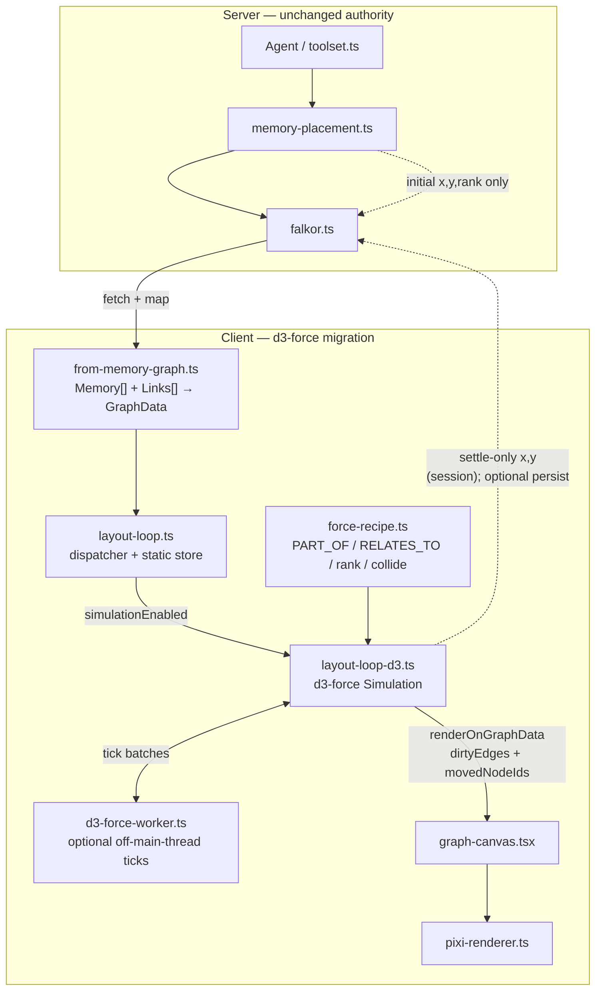

# D3-Force Layout Migration Plan

**Status:** Planning only — no implementation in this document.  
**Scope:** Shift Spy’s client-side graph layout simulation from Graphology + ForceAtlas2 (FA2) to **d3-force**, while preserving `memory-placement` as the server-side authoritative placement layer and FalkorDB as the persistence store for `x` / `y` / `rank`.

**Cross-check method:** This plan simulates a multi-agent review per `rules/orchestration/AGENTS.md` — four independent reviewer lenses (Architecture, Product/UX, Performance, API/Data) with findings, risks, recommendations, then a reconciled decision.

---

## Executive summary

Spy’s layout stack today is **split by responsibility**:

| Layer | Role today |
|-------|------------|
| `memory-placement.ts` | **Authoritative** placement when the agent weaves new memories (fan-under-parent, spiral collision, rank derivation) |
| FalkorDB (`x`, `y`, `rank`) | **Durable** layout store; `setMemoryLayout` after placement; `upsertMemory` coalesces so content edits don’t move nodes |
| `layout-loop.ts` (static) | **Product path** — passthrough `GraphData` store; `LAYOUT_SIMULATION_ENABLED = false` |
| `layout-loop-sim.ts` + `fa2-worker.ts` | **Optional** continuous FA2 settle; dynamic-import only; dead in product |

**Why d3-force over FA2 long-term**

1. **Composable semantics** — Spy’s schema is intentionally hybrid: `PART_OF` (hierarchical, parent-anchored) and `RELATES_TO` (associative mesh). d3-force supports distinct link distances/strengths, fixed anchors (`fx`/`fy`), collide radii, and custom rank-band forces in one simulation. FA2 treats all edges as undirected attraction/repulsion with limited per-edge typing.
2. **Incremental weaving** — Agent sessions add nodes and edges over time. d3-force’s `simulation.nodes()` / `simulation.force()` API supports hot-adding bodies, reheating alpha, and pinning parents without rebuilding a Graphology instance each worker step.
3. **Dependency topology** — FA2 path pulls `graphology` + `graphology-layout-forceatlas2` (~sim-only). d3-force is a focused ~30KB module with no graph container requirement; aligns with “static path must not load sim” chunk discipline already enforced in `layout-loop.ts`.
4. **Worker fit** — FA2 worker rebuilds a full Graphology graph per message. d3-force can maintain simulation state in a worker across ticks (or rebuild cheaply from plain arrays), preserving the existing `Float32Array` position protocol.
5. **Rank-aware motion** — Visual scale already uses stored `rank` (`graph-scale.ts`: `NODE_RANK_Q`, edge band by parent rank). d3-force custom forces can bias Y-bands by rank without recomputing rank on the canvas.

**Why not Dagre (or Dagre-only)**

- Dagre excels at layered DAGs but **cannot** express associative `RELATES_TO` cross-links without fighting the hierarchy.
- Spy’s product metaphor is a **living web**, not a org-chart export. Dagre is a one-shot layout; d3-force supports continuous ambient motion (`brief.md`: “ambient over loud”).
- Rank is **stored at write time** (`memory-placement`, toolset) — not recomputed by the renderer. Dagre would duplicate rank semantics or fight stored coordinates.

**Reconciled direction:** Keep `memory-placement` + Falkor as the **authoritative placement pipeline**. Replace FA2 with d3-force as the **optional client settle / ambient motion layer**, reusing existing `LayoutRenderOptions` dirty plumbing into Pixi. Deprecate `graphology` + `graphology-layout-forceatlas2` after parity verification.

---

## Current topology

```mermaid
flowchart TB
  subgraph Server["Server (Node.js)"]
    LLM["Agent / toolset.ts"]
    MP["memory-placement.ts<br/>fan + spiral + rank"]
    FK["falkor.ts<br/>upsertMemory / setMemoryLayout<br/>x, y, rank on :Memory"]
    LLM -->|"upsertMemory / linkMemories"| MP
    MP -->|"placeAsRoot / placeAsChild / placeForRelates"| FK
  end

  subgraph ClientStatic["Client — product path (static)"]
    MOCK["fixtures/mock-graph.ts<br/>or future Falkor fetch"]
    LL["layout-loop.ts<br/>LAYOUT_SIMULATION_ENABLED=false"]
    GC["graph-canvas.tsx<br/>renderOnGraphData"]
    PIXI["pixi-renderer.ts<br/>DotStream + RimLock + bake worker"]
    MOCK --> LL
    LL -->|"GraphData clone"| GC
    GC -->|"setGraphData + dirtyEdges"| PIXI
  end

  subgraph ClientSim["Client — sim path (unused in product)"]
    LLS["layout-loop-sim.ts<br/>Graphology + FA2"]
    FA2W["fa2-worker.ts"]
    LLS <-->|"step message"| FA2W
  end

  LL -.->|"createLayoutLoopAsync<br/>dynamic import"| LLS
  FK -.->|"memoryGraphToGraphData<br/>(future live feed)"| MOCK

  style ClientSim fill:#1a1028,stroke:#8838DE,stroke-dasharray: 5 5
```



**Data flow today (product):** Mock/stress `GraphData` → static layout loop (no position mutation) → `diffGraphDirty` or explicit sim dirty → Pixi partial bake. Agent placement writes DB coordinates that are **not yet** wired to `/graph` live.

---

## Target topology



**Key invariant:** `memory-placement` remains the **only** server path that assigns initial layout for new/weaved nodes. d3-force may **refine** positions in the client session; persistence back to Falkor is a **later product decision** (Phase 5+).

---

## Layer responsibilities

| Layer | Owns | Must NOT own | Persistence |
|-------|------|--------------|-------------|
| **memory-placement** | Initial `x`, `y`, `rank` for create/link; collision geometry; fan-under-parent | Continuous motion; edge-type physics; canvas render | Via toolset → `setMemoryLayout` |
| **d3-force sim** (`force-recipe` + `layout-loop-d3`) | In-session position refinement; ambient motion; partial dirty emit | Rank derivation; LLM-facing placement; topology mutation | None by default (session ephemeral) |
| **FalkorDB** | Canonical `Memory.x/y/rank`; embeddings; `PART_OF` / `RELATES_TO` edges | Layout algorithm | Disk (FalkorDBLite) |
| **Pixi / DotStream** | World-space bake, rim lock, signal pulses, viewport residency | Layout physics | None |
| **toolset** | Orchestrate upsert/link + call placement helpers | Coordinates in tool schemas | Delegates to Falkor |

---

## Custom force recipe proposal

Module: `src/lib/graph/force-recipe.ts` (new, pure — no Pixi/React).

### Design goals

1. Respect **stored rank** — do not recompute hierarchy depth on canvas.
2. **Pin parents** on `PART_OF` link events; children get seeded from `memory-placement` coordinates.
3. **Differentiate edge types** — hierarchy vs associative (matches `graph-style.ts` visual language).
4. **Collide** using rank-scaled radii consistent with `nodeScreenRadius(rank, zoom)` at `zoom=1` world units.
5. **Recenter** weakly at origin (replace FA2 `recenterToOrigin` drift fix).

### Proposed forces

```typescript
// Illustrative — implementation detail for Phase 1
type ForceRecipeInput = {
  nodes: SimulationNode[];  // id, x, y, rank, fx?, fy?
  edges: { id, source, target, type: "PART_OF" | "RELATES_TO" }[];
};

// 1. forceLink — split by type
//    PART_OF:     distance = PARENT_CHILD_RADIUS (56, match memory-placement)
//                 strength = 0.9 (stiff hierarchy)
//    RELATES_TO:  distance = 90
//                 strength = 0.15 (soft associative pull)

// 2. forceCollide — radius(rank) = NODE_BASE_PX * NODE_RANK_Q^rank * collideScale
//    collideScale ≈ 3.0 world units (tune in verify)

// 3. forceManyBody — charge strength -30..-80 (mild repulsion; tune per stress fixture)

// 4. forceY (custom rank band) — targetY = rank * RANK_BAND_HEIGHT (e.g. 72px world)
//    strength scales: 0.05 roots, 0.12 deep nodes (keeps tree vertical bias)

// 5. forceX — weak centering per rank cohort (0.02) OR custom forceRadial from parent

// 6. Parent anchor — for nodes with parentIds.length > 0:
//    optional fx/fy pin on parent nodes during "weave settle" window (300–800ms)
//    children never pinned after initial placement frame

// 7. forceCenter(0, 0) — strength 0.03 (global drift control)
```

### Simulation parameters

| Parameter | Initial value | Notes |
|-----------|---------------|-------|
| `alpha` | 1.0 on topology change | Reheat on `setGraphData` |
| `alphaDecay` | 0.02–0.05 | Faster settle than default for KB increments |
| `alphaMin` | 0.001 | Stop rAF when below threshold |
| `velocityDecay` | 0.4 | Damping for “ambient not bouncy” |
| `iterationsPerFrame` | 1–3 ticks | Match FA2 `iterationsPerFrame` option |

### Motion policy (product)

- **Default:** `LAYOUT_SIMULATION_ENABLED = false` until product explicitly enables ambient weave.
- **When enabled:** subtle motion only — no violent re-layout; pinned roots; `brief.md` “ambient over loud”.
- **New node weave:** single reheat burst on the affected subtree + incident `RELATES_TO` edges, not full-graph explosion.

---

## Cross-check: Architecture / topology lens

*Reviewer stance: deep module boundaries, dependency graph, worker strategy (deepseek-v4-pro style).*

### Findings

- Clean seam already exists: `layout-loop.ts` dispatcher + dynamic import pattern isolates sim from static chunk (`layout-loop.ts` L11–14, L158–193).
- `GraphData` is the correct DTO boundary; Graphology was always an implementation detail of sim (`graph-data.ts` L4–6).
- FA2 worker rebuilds graph per step (`fa2-worker.ts` L94–114) — wasteful at KB scale; d3-force can reuse node arrays.
- `force-recipe.ts` should be importable from worker and main thread (pure functions + factory).
- `from-memory-graph.ts` is the Falkor→canvas adapter; no layout logic belongs there.

### Risks

| Risk | Severity | Mitigation |
|------|----------|------------|
| d3-force in main bundle if import guard fails | High | Keep `layout-loop-d3.ts` behind same dynamic import as FA2 sim |
| Simulation state diverges from `GraphData` clone contract | Medium | Mirror FA2 `syncPositionsFromSim` — only mutate `x`/`y` on emit |
| Worker shared code duplication | Low | Single `force-recipe.ts`; worker imports only recipe + d3-force |
| Breaking `LayoutLoopHandle` API | Medium | Preserve `start/stop/step/setGraphData/getGraphData/status` |

### Recommendations

1. Add `layout-loop-d3.ts` parallel to `layout-loop-sim.ts`; switch dispatcher import target via feature flag `LAYOUT_ENGINE: "static" | "d3" | "fa2"`.
2. Rename worker `fa2-worker.ts` → deprecate; add `d3-force-worker.ts` with identical response shape (`Float32Array` + `nodeIds`).
3. Extract `recenterToOrigin` logic into shared `layout-center.ts` or fold into `forceCenter`.
4. Do **not** move placement geometry into d3-force — keep `memory-placement.ts` server-only.

---

## Cross-check: Product / UX lens

*Reviewer stance: living web aesthetic, edge semantics, incremental agent weaving (MiniMax-M3 style).*

### Findings

- Product voice: “alien spider weaves web” — **signal pulses** on edges (`graph-canvas.tsx`) already sell “living”; layout motion is secondary ambient layer.
- `PART_OF` vs `RELATES_TO` must **look and behave** differently: hierarchy bands vs soft mesh (`graph-style.ts` pulse speeds, edge widths).
- Agent weaves incrementally (`toolset.ts`): one node at a time, parent stays put (`memory-placement` policy L12–13).
- Static graph is **acceptable** for v1 product (`LAYOUT_SIMULATION_ENABLED = false`); motion is opt-in polish, not blocker for chat-first goal (`AGENTS.md` short-term goal).

### Risks

| Risk | Severity | Mitigation |
|------|----------|------------|
| Continuous sim disorients users during pan/zoom | Medium | Motion only when `alpha > alphaMin`; freeze sim while panning (optional) |
| Hierarchy collapse when RELATES_TO pulls child away from parent | High | Stiff `PART_OF` links + parent pin window; weaker `RELATES_TO` |
| “Jelly graph” violates dark utility register | Medium | Low alpha, high velocityDecay, no bouncy defaults |
| User expects DB position = screen position | Low | Document: placement is authoritative; sim is cosmetic unless persist-on-settle ships |

### Recommendations

1. **Phase 4 gate:** UX review on mock + stress (`?stress=1`) with sim on — verify hubs don’t implode.
2. Tie motion to **Signals** toggle or separate “Weave motion” control (product choice).
3. On `linkMemories` PART_OF, client should **not** re-place — server already did; client only reheat sim locally when live feed arrives.
4. Preserve rank-based node sizing during motion (rank is stored, not sim-derived).

---

## Cross-check: Performance / graph-client lens

*Reviewer stance: Pixi DotStream, dirty edges, quality bans, KB scale.*

### Findings

- Pixi path is optimized for **partial position updates** (`layout-loop-sim.ts` L232–246, `graph-canvas.tsx` L182–204).
- `incidentEdgeIds` + `expandDirtyEdgesForHubs` rim-couple dirty regions — sim must continue emitting `movedNodeIds` + `dirtyEdges`.
- Quality bans remain: no LOD/maxDots/skipOuterLats/half-res sprites (`AGENTS.md` Constraints). Layout engine choice does not relax bans.
- Client pure-perf ceiling **achieved** for static pan/zoom; sim is orthogonal — adds CPU cost per tick, not bake shortcuts.
- FA2 off-main-thread already landed; d3 worker should preserve “skip overlapping steps” (`layout-loop-sim.ts` L272–273).
- Full KB residency (Tier D) **not achieved** — sim on entire graph is not viable; future viewport slices must gate simulation subgraph.

### Risks

| Risk | Severity | Mitigation |
|------|----------|------------|
| Main-thread jank if worker disabled | High | Fail-open to main with capped nodes; worker default for `|V| > 200` |
| Dirty under-reporting → rim artifacts | High | Unit test: moved node always expands incident edges + hub rims |
| Stress fixture collapse | Medium | `verify:d3-layout` on `createLargeStressGraphData` |
| Sim runs on off-screen nodes | Medium | Phase 6: subgraph sim from `GraphSpatialIndex` viewport + overscan |

### Recommendations

1. Reuse **exact** `LayoutRenderOptions` contract — no Pixi changes required for Phase 1–4.
2. Add `verify:d3-layout` mirroring `verify-mock-layout.mjs` (step moves nodes; static path unchanged).
3. Profile: 40 hubs × 12 spokes stress with worker on/off; budget < 4ms/tick on M1 baseline.
4. Defer viewport-only sim until Falkor live feed + residency product mode.

---

## Cross-check: API / data lens

*Reviewer stance: rank/x/y as DB-owned; placement authoritative vs sim settle-only.*

### Findings

- **Hard lock:** `x`, `y`, `rank` are system-owned — not in LLM tool schemas (`toolset.ts` L77, L132; `memory-placement.ts` L9–11).
- `upsertMemory` coalesces layout (`falkor.ts` L133–144); content-only updates preserve position.
- `setMemoryLayout` force-writes after link placement (`falkor.ts` L267–297).
- `memoryGraphToGraphData` copies stored layout through — **does not recompute** (`from-memory-graph.ts` L7–8).
- `GraphNode.rank` is stored on DTO (`graph-data.ts` L41–42); layout loop preserves rank on clone (`layout-loop.ts` L110–111).

### Risks

| Risk | Severity | Mitigation |
|------|----------|------------|
| Sim writes back to Falkor unintentionally | High | No `setMemoryLayout` from client in Phase 1–4 |
| Rank drift if sim adjusts Y bands | Medium | Custom force uses rank as **input only**; never write rank from sim |
| Double placement (server + client) | Medium | Client ingests DB positions as simulation seeds; no `placeMemoryNode` on client |
| Stale canvas after agent weave | High | Phase 5: session poll / SSE / prep-session pushes `GraphData` patch |

### Recommendations

1. **Authoritative rule:** Falkor `x/y/rank` win at ingest; sim produces session-overrides only.
2. Optional Phase 7: `persistSettledLayout()` — debounced write after `alpha < alphaMin`, gated by product flag.
3. Add Falkor `listMemoriesForGraph(viewport?)` before persisting sim positions at scale.
4. Toolset unchanged in Phases 1–4 except docs/comments referencing layout engine.

---

## Phased migration

### Phase 0 — Planning & spike (this document)

| Task | Files | Deps |
|------|-------|------|
| Approve plan | `D3-FORCE-LAYOUT-PLAN.md` | — |
| Spike script (no product wire) | `scripts/spike-d3-force.mjs` (optional) | `d3-force` dev experiment |

**Exit criteria:** Team sign-off on authority split (placement vs sim).

---

### Phase 1 — Force recipe (pure module)

| Task | Files | Deps |
|------|-------|------|
| Add `d3-force` | `package.json` | `npm install d3-force` (+ `@types/d3-force` if needed) |
| Implement recipe | `src/lib/graph/force-recipe.ts` | `d3-force`, `graph-scale.ts` tokens |
| Unit assertions | `scripts/verify-d3-force-recipe.mjs` | recipe exports |
| Export from barrel | `src/lib/graph/index.ts` | optional `export { buildForceSimulation }` |

**Exit criteria:** Recipe builds simulation from `GraphData`; 100 ticks on mock graph finite coords; ranks unchanged.

---

### Phase 2 — d3 layout loop (main thread)

| Task | Files | Deps |
|------|-------|------|
| Create d3 sim loop | `src/lib/graph/layout-loop-d3.ts` | `force-recipe.ts`, mirrors `layout-loop-sim.ts` API |
| Wire dispatcher | `src/lib/graph/layout-loop.ts` | `LAYOUT_ENGINE` flag or replace sim import target |
| Preserve static path | `layout-loop.ts` `createStaticLayoutLoop` | unchanged |

**Exit criteria:** `createLayoutLoopAsync({ simulationEnabled: true, layoutEngine: "d3" })` passes adapted `verify-mock-layout` checks.

---

### Phase 3 — Worker offload

| Task | Files | Deps |
|------|-------|------|
| d3 worker | `src/lib/graph/d3-force-worker.ts` | same message shape as `fa2-worker.ts` |
| Integrate fail-open | `layout-loop-d3.ts` | Worker → main thread fallback |
| Seq / in-flight guard | copy pattern from `layout-loop-sim.ts` L169–173, L272–273 | — |

**Exit criteria:** Worker path passes stress fixture smoke; main-thread `step()` remains sync for verify.

---

### Phase 4 — Verification & product flag

| Task | Files | Deps |
|------|-------|------|
| New verify script | `scripts/verify-d3-layout.mjs`, `package.json` script `verify:d3-layout` | Phase 2–3 |
| Update `verify-mock-layout.mjs` | parametrize engine (`FA2` → `d3`) or duplicate checks | — |
| UX review | `/graph`, `/graph?stress=1` | manual |
| Flip `LAYOUT_SIMULATION_ENABLED` | `layout-loop.ts` | **product decision** — default stays `false` until review passes |

**Exit criteria:** All verify scripts green; quality bans unchanged; motion policy signed off.

---

### Phase 5 — Live Falkor feed (adjacent, not strictly d3)

| Task | Files | Deps |
|------|-------|------|
| Graph fetch API | `src/app/api/graph/route.ts` or extend `prep-session` | `falkor.ts` queries |
| Wire canvas | `graph-canvas.tsx` | `memoryGraphToGraphData` |
| Incremental patch | `layoutLoop.setGraphData` on agent events | chat/session integration |

**Exit criteria:** Agent weave updates `/graph` without full reload; placement from server visible immediately.

---

### Phase 6 — Viewport-scoped sim (KB scale)

| Task | Files | Deps |
|------|-------|------|
| Subgraph extraction | `src/lib/graph/sim-subgraph.ts` | `GraphSpatialIndex` |
| Sim only visible + overscan | `layout-loop-d3.ts` | Phase 5 live feed |

**Exit criteria:** Stress 40×12 with sim on meets tick budget; no full-graph FA2/d3 on 10k nodes.

---

### Phase 7 — FA2 deprecation & optional persist

| Task | Files | Deps |
|------|-------|------|
| Remove FA2 path | delete `layout-loop-sim.ts`, `fa2-worker.ts` | Phase 4 stable 2 weeks |
| Remove deps | `package.json` | remove `graphology`, `graphology-layout-forceatlas2` |
| Optional persist settle | server route + client debounce | product flag |

**Exit criteria:** `rg graphology` clean; bundle analyze shows sim chunk = d3-force only.

---

## FA2 deprecation path

| Milestone | Action |
|-----------|--------|
| **M0 (now)** | FA2 remains; `LAYOUT_SIMULATION_ENABLED = false`; no product behavior change |
| **M1** | d3 loop lands behind `layoutEngine: "d3"`; FA2 still available as fallback |
| **M2** | `verify-mock-layout` defaults to d3; FA2 runs in CI compat job only |
| **M3** | Remove `fa2-worker.ts` from dynamic import; delete `layout-loop-sim.ts` |
| **M4** | `npm uninstall graphology graphology-layout-forceatlas2` |
| **M5** | Update `AGENTS.md` What's left: “d3-force sim ready; FA2 removed” |

**Rollback:** Keep `layout-loop-sim.ts` on a git tag until M3; feature flag `layoutEngine: "fa2"` for one release cycle.

---

## Verification plan

### Existing scripts (must stay green)

| Script | Relevance |
|--------|-----------|
| `verify:mock-layout` | Layout loop API, static path frozen, sim moves nodes |
| `verify:hierarchy` | Stored ranks preserved through layout clone |
| `verify:rtc-camera` | Camera independent of layout engine |
| `verify:node-size` | Rank-scaled radii unchanged |
| `verify:reorg-scope` | Module boundary / import hygiene |

### New scripts

| Script | Asserts |
|--------|---------|
| `verify:d3-force-recipe` | Mock graph: finite positions, ranks unchanged, PART_OF shorter mean distance than RELATES_TO |
| `verify:d3-layout` | d3 sim `step()` moves ≥1 node; static path moves 0; worker optional smoke |
| `verify:layout-chunk` | Static import of `layout-loop.ts` does not resolve `d3-force` (build grep / bundle guard) |
| `verify:dirty-emit` | Sim emit includes `dirtyEdges` ⊇ `incidentEdgeIds(moved)` |

### Manual QA

1. `/graph` — static default; pan/zoom smooth; Signals on.
2. `/graph?stress=1` — sim off: no regression from pure-perf baseline.
3. Sim on (dev flag): 60s observation — no runaway drift; recenter holds origin.
4. Agent weave (Phase 5): create + PART_OF link — node appears at fan position without client placement.

---

## Open questions / decision log

| ID | Question | Options | Owner | Status |
|----|----------|---------|-------|--------|
| Q1 | Default sim on for `/graph`? | A) off (current) B) on subtle C) tied to Signals | Product | **Pending** — default A |
| Q2 | Persist sim-settled positions to Falkor? | A) never B) manual “snap” C) auto debounce | Product + API | **Pending** — default A until Phase 7 |
| Q3 | Pin parents permanently or timed window? | A) fx/fy until alpha min B) 500ms pin C) never pin | UX | **Pending** — lean B |
| Q4 | `layoutEngine` flag vs replace FA2 in-place? | A) parallel modules B) in-place swap | Eng | **Decided** — A (parallel until M3) |
| Q5 | Rank band force strength vs memory-placement Y | A) weak bias B) strong band | UX | **Pending** — start weak (0.05–0.12) |
| Q6 | Viewport-only sim before live feed? | A) yes B) no | Eng | **Pending** — B for spike; A at Phase 6 |

---

## Reconciled decision

After cross-checking four lenses:

1. **Do migrate** client sim from FA2 to d3-force — better fit for typed edges, incremental reheat, and smaller sim bundle.
2. **Do not migrate** server placement — `memory-placement.ts` + toolset + Falkor remain authoritative for `x` / `y` / `rank`.
3. **Do not enable** continuous simulation in product until Phase 4 UX sign-off; static path stays default (`LAYOUT_SIMULATION_ENABLED = false`).
4. **Do preserve** `LayoutLoopHandle` + `LayoutRenderOptions` + dirty edge contract — zero Pixi changes for initial migration.
5. **Do deprecate** Graphology/FA2 only after d3 worker parity + `verify:d3-layout` CI green (Phase 7).
6. **Defer** sim persist to Falkor and viewport subgraph sim to Phases 6–7 — not blockers for engine swap.

---

## Cross-check reconciliation matrix

| Topic | Architecture | Product/UX | Performance | API/Data | **Final call** |
|-------|-------------|------------|-------------|----------|----------------|
| Replace FA2 with d3 | ✅ composable modules | ✅ ambient weave fit | ✅ worker parity | neutral | **✅ Proceed** |
| Keep memory-placement server-side | ✅ clean boundary | ✅ parent stays put | neutral | ✅ authoritative | **✅ Keep** |
| Static default (sim off) | ✅ chunk discipline | ✅ not distracting | ✅ perf ceiling | ✅ DB = truth | **✅ Keep false** |
| Custom rank-band force | ✅ in force-recipe | ⚠️ tune carefully | neutral | ⚠️ rank read-only | **✅ Weak bias only** |
| Persist sim to Falkor | ⚠️ extra API | ⚠️ user confusion | ⚠️ write load | ❌ conflicts with placement | **❌ Defer Phase 7** |
| Remove graphology | ✅ simpler deps | neutral | ✅ smaller sim chunk | neutral | **✅ After M3** |
| Viewport-only sim | ✅ scale path | neutral | ✅ required at KB | neutral | **✅ Phase 6** |
| Dagre for PART_OF | ❌ dual engine | ❌ not living web | neutral | ❌ fights stored xy | **❌ Rejected** |
| Motion tied to Signals | neutral | ⚠️ either/or | neutral | neutral | **⏳ Q1 open** |

**Agreements (all lenses):** `GraphData` DTO boundary; dirty partial bake; placement authority on server; phased migration with static path unchanged; quality bans untouched.

**Conflicts resolved:**
- *Performance vs Product (continuous motion):* motion opt-in, subtle params, off by default.
- *API vs Product (persist settle):* defer persist — session cosmetic only until explicit product flag.
- *Architecture vs Performance (worker):* mandatory for large graphs, fail-open for tests.

---

## File-level dependency summary

### Add
- `d3-force` (npm)
- `src/lib/graph/force-recipe.ts`
- `src/lib/graph/layout-loop-d3.ts`
- `src/lib/graph/d3-force-worker.ts`
- `scripts/verify-d3-force-recipe.mjs`
- `scripts/verify-d3-layout.mjs`

### Modify
- `src/lib/graph/layout-loop.ts` — dispatcher targets d3 module
- `src/lib/graph/index.ts` — exports (optional)
- `package.json` — scripts + dependency
- `scripts/verify-mock-layout.mjs` — d3 engine
- `AGENTS.md` — What's left (post-M3)

### Remove (Phase 7)
- `src/lib/graph/layout-loop-sim.ts`
- `src/lib/graph/fa2-worker.ts`
- `graphology`, `graphology-layout-forceatlas2`

### Unchanged
- `src/lib/memory-placement.ts`
- `src/lib/falkor.ts` (layout storage API)
- `src/ai/toolset.ts` (Phases 1–4)
- `src/lib/graph/pixi-renderer.ts`
- `src/components/graph/graph-canvas.tsx` (until Phase 5 feed)

---

*Document version: 1.0 — 2026-07-28*
